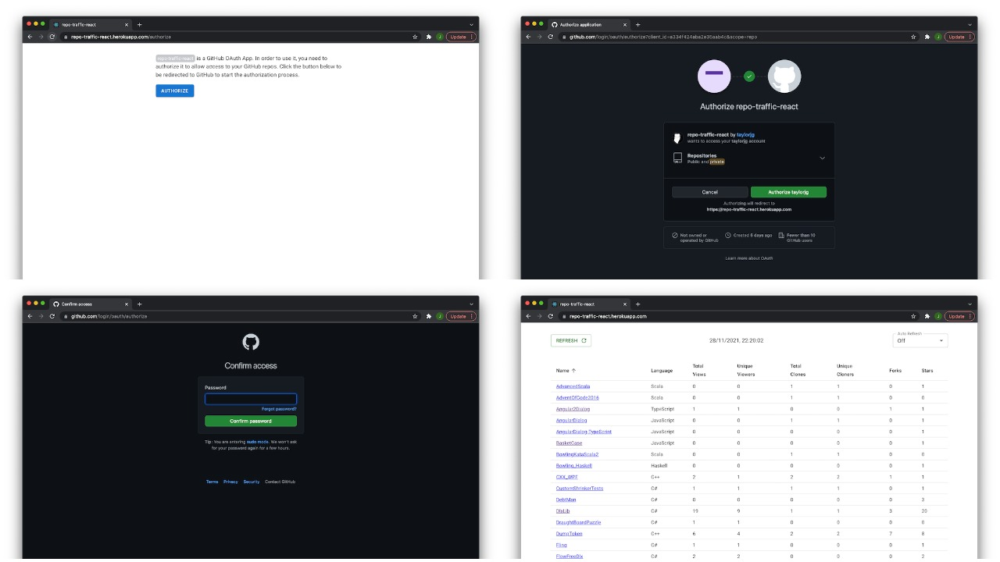

# Description

I have used `React` for a few years and I have some familiarity with `TypeScript`
but this is my first attempt at using them together. The backend Express server
also uses `TypeScript`.

This little app lists your GitHub repos along with some traffic details.
It is a GitHub OAuth App - you need to authorize it to allow access to your GitHub repos.
Once authorized, it maintains the GitHub access token in an
encrypted cookie (`github-token`).

# Authorization steps

1) If you have not authorized yet, then I initially show a view explaining that you need to authorize
and provide a button to start the process
2) You are then redirected to GitHub where you can review the permissions required by this app - namely the `public_repo` scope
3) You will need to login to your GitHub account to complete the process
4) After successful authorization, you are redirected to the home view

# Things in this project that I already have experience with

* React and Hooks
* JavaScript
* Node.js
* Express
* Async/await, generators and async generators
* GitHub REST API
* GitHub GraphQL API
* Deployment to render.com

# Things in this project that were new to me

* Node.js Express server **with TypeScript**
* React **with TypeScript**
* react-query
* graphql-request
* MUI
* GitHub OAuth Apps
* CI/CD workflow using GitHub Actions

# TODO

* ~~Turn this into a GitHub OAuth App~~
* ~~Add screenshots showing the authorization process~~
* Add a link to review access
  * See [Directing users to review their access](https://docs.github.com/en/developers/apps/building-oauth-apps/authorizing-oauth-apps#directing-users-to-review-their-access)
* ~~Show totals (views, clones, stars, forks)~~
* Show user details
* Show stats (elapsed time, number of API calls, rate limit details)
* ~~Use conditional requests as these don't count against the rate limit when the resource is unchanged i.e. when status code 304 is returned~~
  * ~~See [Conditional requests](https://docs.github.com/en/rest/overview/resources-in-the-rest-api#conditional-requests)~~
* ~~Add CI/CD workflow using GitHub Actions~~
* Semantic markup
* Accessibility (a11y)
* Responsive UI
* Tests
  * ~~Backend~~
  * Frontend

# Links

* [GitHub REST API](https://docs.github.com/en/rest)
* [Building OAuth Apps](https://docs.github.com/en/developers/apps/building-oauth-apps)
* [OAuth Applications API](https://docs.github.com/en/rest/reference/apps#oauth-applications-api)
* [GitHub Actions](https://github.com/features/actions)
* [MUI: The React component library you always wanted](https://mui.com/)
* [React Query - Hooks for fetching, caching and updating asynchronous data in React](https://react-query.tanstack.com/)
